# Neural Networks and Deep Learning
## Greifswald, March 9-10, 2026
Go to [Moodle](https://moodle.uni-greifswald.de/course/view.php?id=5405) for
 - Q & A forum
 - feedback
 - announcements
 - quiz

## Get Started

1. Login to [Moodle](https://moodle.uni-greifswald.de/course/view.php?id=5405) (requires registration). Leave the Q & A tab open in your browser.
2. Login at [apphub.wolke.uni-greifswald.de](https://apphub.wolke.uni-greifswald.de/), choose **Computing -> Deep Learning -> Select -> Frontend Code -> Select**, set the time to approximately **8 hours**, then click **Start**.
3. Once the session is booted, click the **Open** button.
4. In VSCode, open a terminal (`` Ctrl+` ``) and run: `git clone https://github.com/DataCompetency/KI-Block.git`
5. Install required packages in the same terminal:

   ```bash
   /opt/conda/envs/d2l/bin/pip install pandas torchsummary "opencv-python-headless==4.8.0.76" "numpy==1.23.5"
   ```

6. `cd` into the cloned folder, then open it in VSCode via **File -> Open Folder**.
7. Navigate to the exercises folder and open **es0.ipynb**.
8. Select **d2l (Python 3.11.11)** as the Python kernel.

> **Note:** Instructions last updated March 9, 2026 — subject to change.
 
## Course Overview
In this course you will get practical knowledge to perform general machine learning and, in particular, computer vision tasks with TensorFlow. Moreover, you will get the necessary theoretical background to troubleshoot when transferring the knowledge to solve own problems. The class will be hands-on and interactive. A device with a browser, keyboard and a VPN connection to the Rechenzentrum is required.

### (Stochastic) Gradient Descent

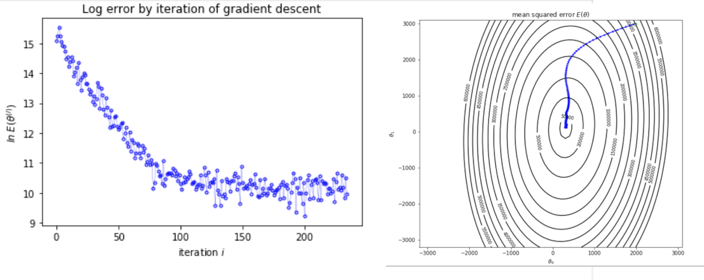

### Linear Regression with TensorFlow 2

<p>
  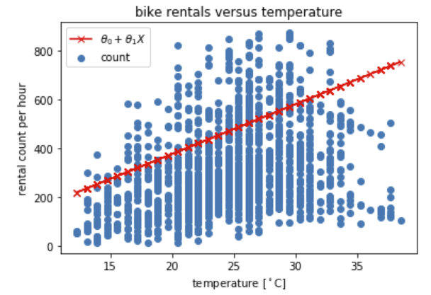
  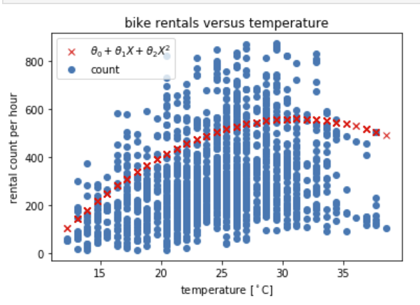
</p>


### Expore the Effect of Critical Parameters

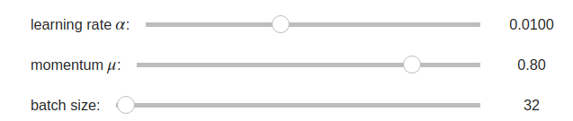


### Derive and Optimize

<p align="center">
 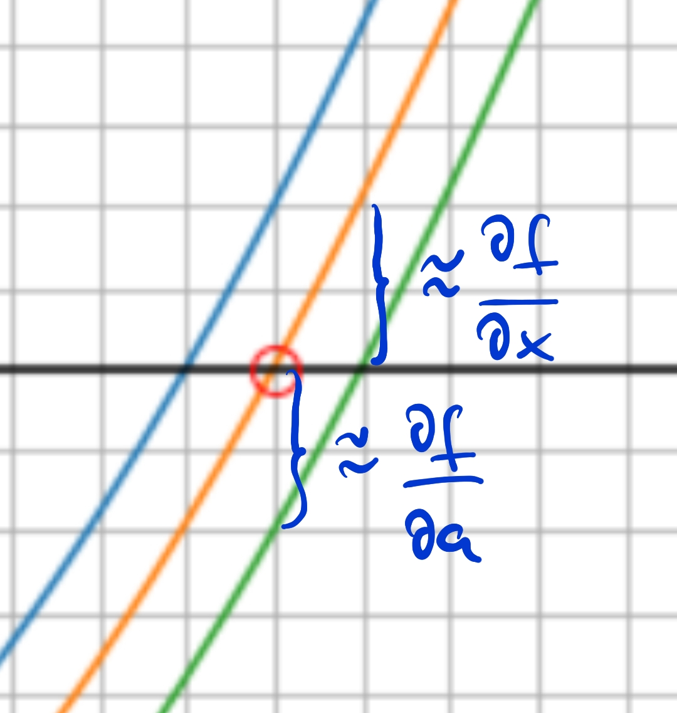
</p>

### Fully-Connected Neural Network for Regression

<p align="center">
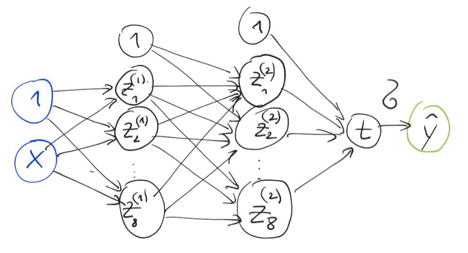
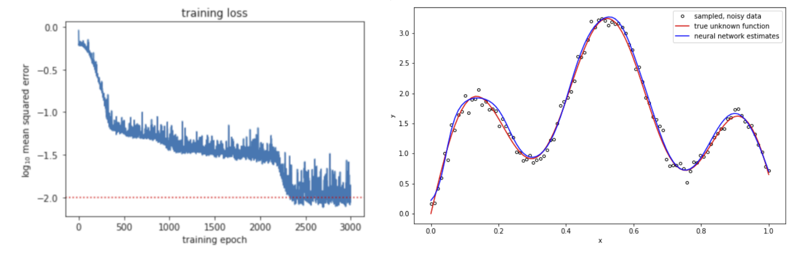
</p>


### Convolutional Neural Networks (Architectures, Filters, Feature Maps)

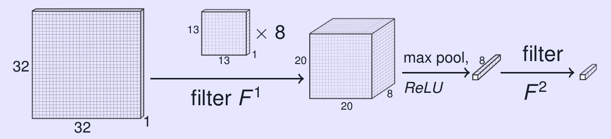
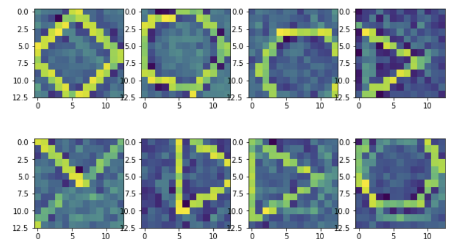
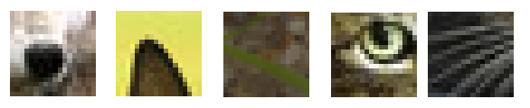
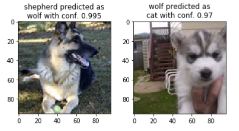


### Sequence and Foundation Models for DNA

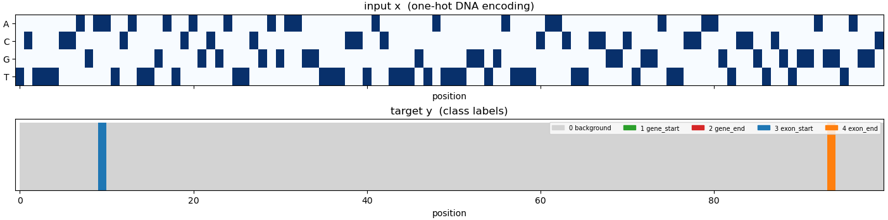


